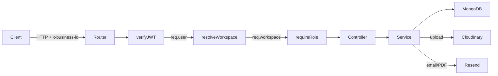
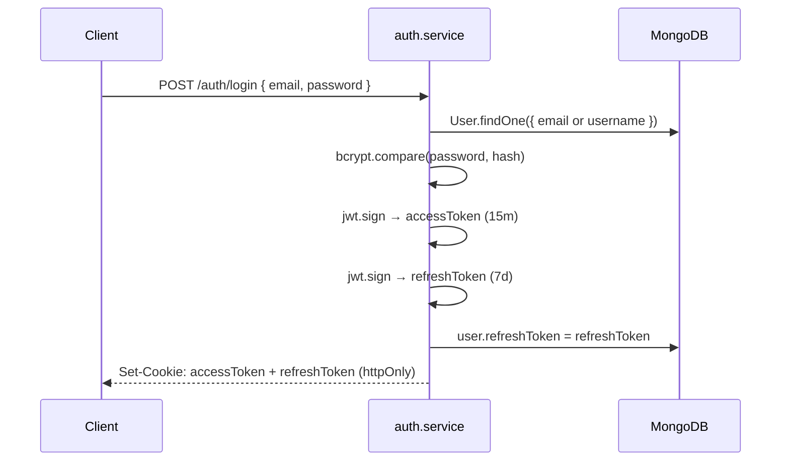
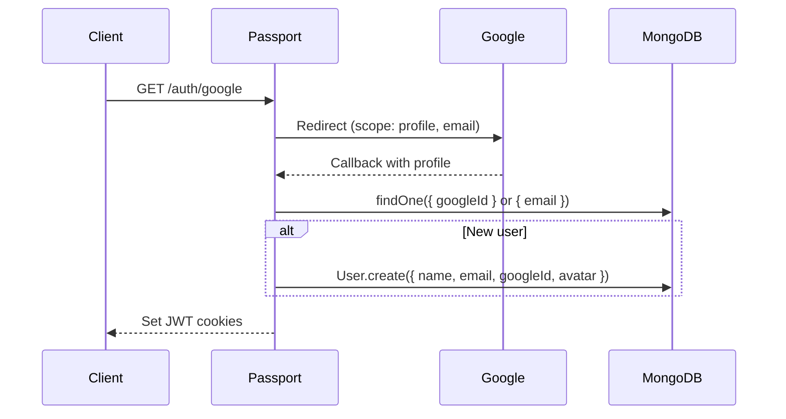
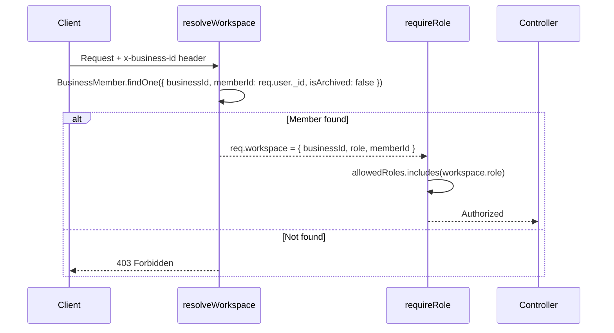

# Architecture & Engineering Decisions

## Request Flow



## Middleware Chain

Every business-scoped route passes through three layers before reaching the controller:

| Middleware | Input | Output | Failure |
|-----------|-------|--------|---------|
| `verifyJWT` | Cookie or `Authorization` header | `req.user` | 401 |
| `resolveWorkspace` | `x-business-id` header + `req.user._id` | `req.workspace` | 400 / 403 |
| `requireRole(roles)` | `req.workspace.role` | — | 403 |

Business routes (`/businesses/:businessId`) skip `resolveWorkspace` — they use the path param directly and only require `verifyJWT`.

## Authentication Flows

### Local Login



### Google OAuth



### Password Reset

```mermaid
sequenceDiagram
    C->>S: POST /auth/forgot-password { email }
    S->>S: crypto.randomBytes(32) → rawToken
    S->>S: SHA-256(rawToken) → hashedToken
    S->>DB: user.passwordResetToken = hashedToken (expires 10m)
    S->>Resend: Send email with rawToken in URL
    C->>S: POST /auth/reset-password { token, userId, newPassword }
    S->>S: SHA-256(token) → hash
    S->>DB: findOne({ _id: userId, passwordResetToken: hash })
    S->>S: Verify expiry; set new password; clear reset fields
```

## Workspace Resolution



## Module Pattern

All 8 domain modules follow the same 4-layer structure:

```
*.model.ts      Mongoose schema, interface, indexes, plugins
*.service.ts    Business logic, DB queries, external calls
*.controller.ts Parse request → call service → send response
*.route.ts      Route definitions + middleware chain
```

Controllers are intentionally thin. All business logic lives in services, making them independently testable.

## Engineering Decisions

### 1. `BusinessMember` as a Join Entity

**Problem**: A user can be OWNER in one business and EMPLOYEE in another. Role cannot live on `User`.

**Solution**: `BusinessMember` is a first-class document linking `User` ↔ `Business` with `role` and `permissions[]`. `resolveWorkspace` queries this per-request.

**Tradeoff**: Every business-scoped request requires a DB lookup. Production candidate for Redis caching.

---

### 2. `InvoiceCounter` for Atomic Sequence Numbers

**Problem**: `MAX(invoiceNumber) + 1` races under concurrent requests — two requests can read the same max and generate duplicate numbers.

**Solution**: A dedicated `InvoiceCounter` collection with a compound unique index on `{ businessId, year }`. Uses `findOneAndUpdate + $inc + upsert` inside a MongoDB session alongside the `Invoice.create` call.

**Tradeoff**: Requires a MongoDB replica set. Standalone MongoDB cannot run sessions.

---

### 3. Price Snapshotting on Invoice Items

**Problem**: If a product's price changes after an invoice is created, re-fetching the price at render time silently corrupts historical financial records.

**Solution**: Each `IInvoiceItem` stores `name`, `price`, and `total` at creation time. `productId` is retained for traceability only — pricing is never re-derived from it.

**Tradeoff**: Invoice items diverge from the product catalog over time. This is the correct behavior for financial records.

---

### 4. Atomic Payment + Invoice Closure

**Problem**: Recording a payment and marking the invoice `PAID` are two separate writes. A failure between them leaves the system in an inconsistent state.

**Solution**: Both writes happen in a single MongoDB session. If `amount >= invoice.total`, the invoice status is updated to `PAID` and the payment is created atomically. Either both succeed or both roll back.

---

### 5. Header-Based Workspace Selection

**Problem**: A user belongs to multiple businesses. The active business must be selected per-request without re-authentication.

**Solution**: `x-business-id` header selects the workspace. `resolveWorkspace` validates membership and attaches context. This keeps route paths flat and allows per-request context switching.

**Tradeoff**: URL-prefix tenancy (`/businesses/:id/invoices`) is more REST-conventional but would require restructuring all routes.

---

### 6. Aggregate Pipeline for Cross-Collection Search

**Problem**: Invoice search by client name/email requires joining across collections. Standard MongoDB queries cannot filter on joined data.

**Solution**: `$match` on `businessId` → `$lookup` clients → `$addFields` to unwrap → second `$match` on joined client fields → `$sort` → `aggregatePaginate`. Filtering stays server-side.

---

## Known Issues

| Issue | Impact | Fix |
|-------|--------|-----|
| `workspace.middleware.ts` queries `userId` instead of `memberId` | All workspace-scoped routes return 403 | Change `userId` → `memberId` |
| `@types/express/index.d.ts` imports from wrong path (`businessMember` vs `business-member`) | TypeScript compilation fails | Fix import path |
| `changeInvoiceStatus` uses `=` instead of `===` | All status changes throw 400 | Change to `===` |
| `passport.ts` omits `provider: "google"` on user creation | Google users get `provider: "local"` | Add `provider: "google"` |
| No global error handler in `app.ts` | Unhandled errors produce no structured response | Add `(err, req, res, next)` middleware |
| `removeOnCloudinary` never called | Old images accumulate in Cloudinary | Call on logo/avatar replacement |
