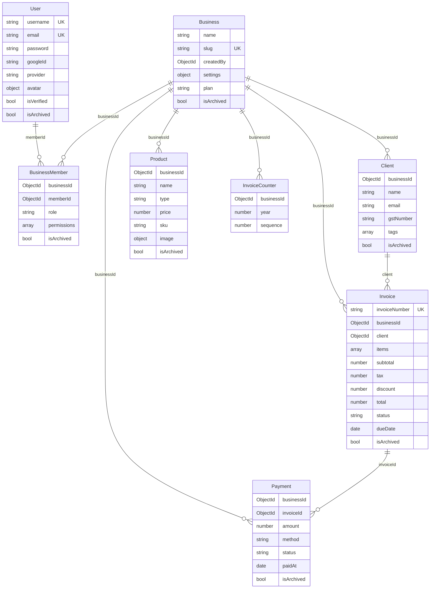

# Database Design

## Entity Relationship Diagram



## Collections & Schemas

### User
| Field | Type | Notes |
|-------|------|-------|
| `username` | String | Unique, indexed, lowercase |
| `email` | String | Unique, indexed, lowercase |
| `password` | String | bcrypt hashed; absent for Google-only accounts |
| `googleId` | String | Set on OAuth login |
| `provider` | `"local"` \| `"google"` | Default: `"local"` |
| `avatar` | `{ url, publicId }` | Cloudinary reference |
| `refreshToken` | String | Stored for validation on refresh |
| `passwordResetToken` | String | SHA-256 hash of raw token |
| `passwordResetTokenExpiry` | Date | 10-minute window |
| `isArchived` | Boolean | Soft delete |

Methods: `generateAccessToken()`, `generateRefreshToken()`, `isPasswordCorrect(password)`

---

### Business
| Field | Type | Notes |
|-------|------|-------|
| `name` | String | Required |
| `slug` | String | Unique, auto-generated via slugify |
| `createdBy` | ObjectId | ref: User |
| `logo` | `{ url, publicId }` | Cloudinary reference |
| `settings.currency` | String | Default: `"INR"` |
| `settings.invoicePrefix` | String | Default: `"INV"` |
| `settings.enableTaxes` | Boolean | Default: `true` |
| `settings.taxPercentage` | Number | Default: `18` |
| `plan` | `"free"` \| `"pro"` | Default: `"free"` |

---

### BusinessMember
| Field | Type | Notes |
|-------|------|-------|
| `businessId` | ObjectId | ref: Business, indexed |
| `memberId` | ObjectId | ref: User, indexed |
| `role` | `OWNER` \| `ADMIN` \| `EMPLOYEE` | Default: `EMPLOYEE` |
| `permissions` | String[] | Reserved for fine-grained control |

---

### Invoice
| Field | Type | Notes |
|-------|------|-------|
| `invoiceNumber` | String | Unique; format `INV-YYYY-NNNN` |
| `businessId` | ObjectId | ref: Business, indexed |
| `client` | ObjectId | ref: Client, indexed |
| `items` | `IInvoiceItem[]` | Embedded; price-snapshotted |
| `subtotal` | Number | Sum of `item.total` |
| `tax` | Number | Percentage (0–100) |
| `discount` | Number | Percentage (0–100) |
| `total` | Number | After tax and discount |
| `status` | Enum | `DRAFT \| SENT \| PAID \| OVERDUE \| CANCELLED` |
| `paidAt` | Date | Set on payment closure |

**IInvoiceItem** (embedded, no `_id`):
```
productId  → traceability only
name       → snapshot at creation
price      → snapshot at creation
total      → price × quantity (snapshot)
```

---

### Payment
| Field | Type | Notes |
|-------|------|-------|
| `businessId` | ObjectId | ref: Business, indexed |
| `invoiceId` | ObjectId | ref: Invoice |
| `amount` | Number | Required |
| `method` | Enum | `CASH \| UPI \| BANK \| CARD` |
| `status` | Enum | `SUCCESS \| PENDING \| FAILED` |
| `paidAt` | Date | Default: now |

---

### InvoiceCounter
| Field | Type | Notes |
|-------|------|-------|
| `businessId` | ObjectId | ref: Business |
| `year` | Number | Calendar year |
| `sequence` | Number | Auto-incremented per business per year |

Unique compound index: `{ businessId, year }`. Used only by `invoice.service.ts` inside a MongoDB session.

---

## Index Strategy

| Collection | Index | Type | Purpose |
|-----------|-------|------|---------|
| `users` | `username`, `email` | Unique | Login lookup |
| `businesses` | `slug` | Unique | URL routing |
| `businessmembers` | `businessId`, `memberId` | Standard | Workspace resolution |
| `clients` | `name` | Text | Search |
| `clients` | `businessId` | Standard | Tenant scoping |
| `products` | `name` | Text | Search |
| `products` | `sku` | Sparse unique | SKU uniqueness |
| `invoices` | `invoiceNumber` | Unique | Number uniqueness |
| `invoices` | `businessId`, `client`, `status` | Standard | Filtering |
| `invoicecounters` | `{ businessId, year }` | Compound unique | Sequence atomicity |
| `payments` | `{ businessId, paidAt }` | Compound | Date range queries |
| `payments` | `{ businessId, invoiceId }` | Compound | Invoice payment lookup |
| `payments` | `{ businessId, status }` | Compound | Status filtering |

## Common Patterns Across All Models

- `isArchived: boolean` (default `false`) — soft delete; all queries filter `{ isArchived: false }`
- `timestamps: true` — Mongoose adds `createdAt`, `updatedAt`
- `metadata: Record<string, unknown>` — schema extensibility without migrations
